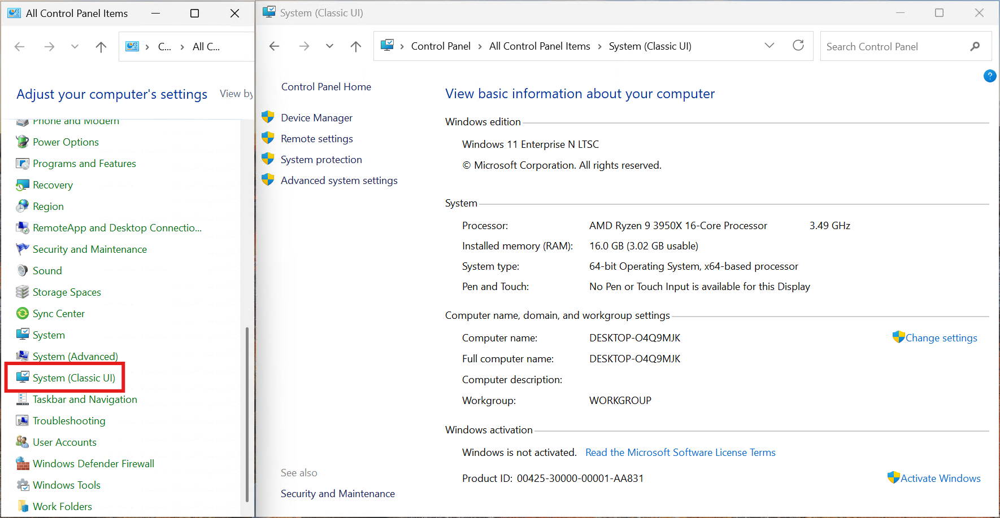

# Control Panel System Classic UI

This repo will create a new Control Panel icon that reverts back the System Page to the Classic UI.

## Instructions

In the repo, find the latest release and download the `system-classic-cpl.reg` file

Launch it and check the `Control Panel`